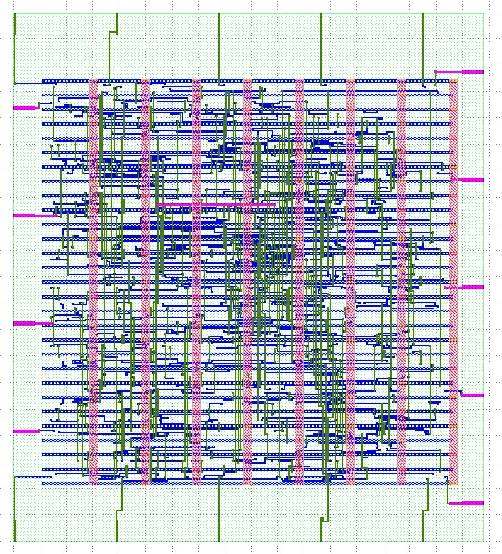

# FPGA-Ignite-LFSR

The choice of feedback taps at flip flop 31, 6, 5, and 1 is based on this paper: <https://www.ijera.com/papers/Vol4_issue6/Version%206/P0460699102.pdf>

The theory which describes where the feedback taps should be to maximize the period of the linear feedback shift register is here: <https://sus.ziti.uni-heidelberg.de/Lehre/WS1819_DST/LFSR.pdf>

To test the design in simulation run the bash script: 
```
./simulate.sh
```
You might have to make the script executable on your machine for this to work!

Dependencies:
```
iverilog
vvp
gtkwave
```

To reduce the input pins, a simple Wishbone interface consisting of five addressable registers was added:

| Address | Register                      |
|---------|-------------------------------|
| 0       | Seed byte 0                   |
| 1       | Seed byte 1                   |
| 2       | Seed byte 2                   |
| 3       | Seed byte 3                   |
| 4       | [1] Load seed, [0] LFSR reset |

This behavior is defined in the ```wb_lsfr.v``` file, and the dummy simulation is also provided with its own ```./simulate_wb.sh``` script and test bench ```wb_lfsr_test.v```.
After validation (a very basic one), the design was passed through the [```OpenLane```](https://github.com/The-OpenROAD-Project/OpenLane) flow.
The resulting circuit area and perimeter as measured in ```klayout```:


Anyway, here is the final layout (no optimizations were performed outside the default flow):

