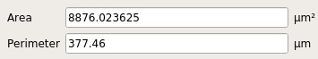

# FPGA-Ignite-LFSR

This is a FABulous FPGA tile: https://github.com/FPGA-Research-Manchester/FABulous
which will be integrated into an open source FPGA design as a hard IP block along with other designs from the hackathon at the FPGA Ignite Summer School 2023 at Heidelberg University: https://fpga-ignite.github.io/

Unfortunately this design was discarded at the last minute and did not make it into the final FPGA design.

The design is a linear feedback shift register pseudo random number generator with a period of 2^32 - 1.

The user can seed the linear feedback shift register with an external physical noise source by connecting to the wishbone through the FPGA fabric. 

We based the initial design on the design from these slides: http://rdsl.csit-sun.pub.ro/docs/PROIECTARE%20cu%20FPGA%20CURS/lecture6[1].pdf

The theory which describes where the feedback taps should be to maximize the period of the linear feedback shift register is available here: <https://sus.ziti.uni-heidelberg.de/Lehre/WS1819_DST/LFSR.pdf>

To test the design in simulation run the bash script: 
```
./simulate.sh
```
You might have to make the script executable on your machine for this to work!

Dependencies:
```
iverilog
vvp
gtkwave
openlane
```

To reduce the number input pins, a simple Wishbone interface consisting of five addressable registers was added:

| Address | Register                      |
|---------|-------------------------------|
| 0       | Seed byte 0                   |
| 1       | Seed byte 1                   |
| 2       | Seed byte 2                   |
| 3       | Seed byte 3                   |
| 4       | [1] Load seed, [0] LFSR reset |

This behavior is defined in the ```wb_lsfr.v``` file. We also provide a script ```./simulate_wb.sh``` and test bench ```wb_lfsr_test.v``` to simulate the wishbone.
After validation (a very basic one), we passed the design through the [```OpenLane```](https://github.com/The-OpenROAD-Project/OpenLane) flow.
The image below shows the resulting circuit area and perimeter as measured in ```klayout```:



The image below shows the final layout (no optimizations were performed outside the default flow):


